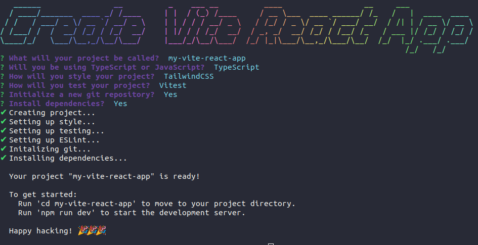

# Create Vite React App
Interactive CLI to easily start a **React + Vite** project and setup optional tools

## 🔧 Tools / Dependencies

**Vite + React scaffolding:** [create-vite](https://github.com/vitejs/vite)

**Create CLI prompts:** [inquirer](https://github.com/SBoudrias/Inquirer.js)

**Generate ASCII title:** [figlet](https://github.com/patorjk/figlet.js)

**Print color gradient:** [gradient-string](https://github.com/bokub/gradient-string)

**Loading spinner:** [nanospinner](https://github.com/usmanyunusov/nanospinner)

**Linting:** [ESLint](https://eslint.org/)

## 💬 Options

- **Project name**
- **Language**
  - Typescript (default)
  - Javascript
- **Styling**
  - TailwindCSS (default)
  - SCSS
  - CSS
- **Testing**
  - Vitest (default)
  - None
- **Initialize git repository**
- **Install dependencies**
